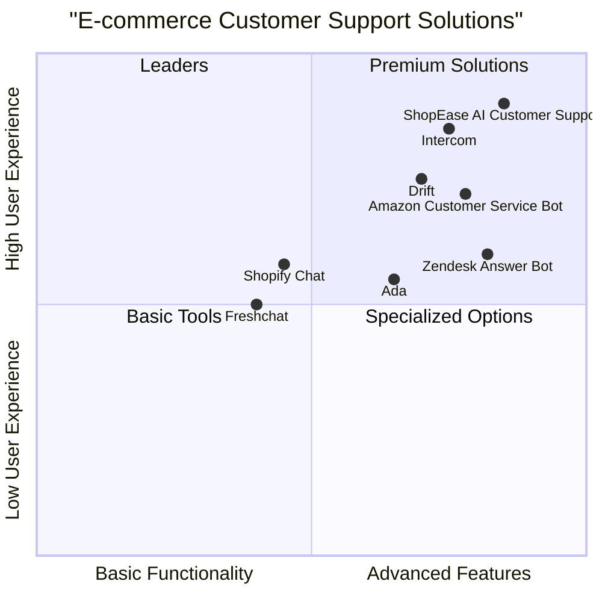

# Product Requirements Document (PRD)

## ShopEase AI Customer Support Chatbot

**Date**: June 11, 2025
**Version**: 1.0
**Project Name**: shopease_ai_customer_support

---

## 1. Introduction

### 1.1 Purpose
This document outlines the comprehensive requirements for the ShopEase AI Customer Support Chatbot, a web-based AI chat interface designed to handle customer service interactions for ShopEase e-commerce platform.

### 1.2 Original Requirements
The project aims to develop a web-based AI chat interface for ShopEase that:
- Efficiently handles customer service interactions across multiple languages.
- Provides personalized support using mocked customer data.
- Seamlessly escalates unresolved queries to a simulated human agent.
- Generates actionable insights from customer conversations to inform business strategy.

The system emphasizes clarity, professionalism, and efficiency in tone, while maintaining a user-friendly, WhatsApp-inspired UI.

## 2. Product Definition

### 2.1 Product Goals
1. **Service Efficiency**: Reduce customer support response times by at least 60% through AI-powered instant responses to common queries.
2. **Global Reach**: Increase international customer satisfaction by providing multilingual support to serve ShopEase's global customer base.
3. **Business Intelligence**: Transform customer interactions into actionable insights to guide product improvements and business strategy.

### 2.2 User Stories

#### As a customer, I want to:
1. **Quick Issue Resolution**: As a customer with a delivery delay, I want to check my order status instantly so that I can plan accordingly without waiting for an email response.
2. **Language Flexibility**: As a non-English speaking customer, I want to communicate in my native language so that I can express my concerns clearly and understand solutions better.
3. **Seamless Escalation**: As a customer with a complex issue, I want my conversation to be seamlessly transferred to a human agent so that my problem gets resolved without repeating information.
4. **Order Management**: As a recent shopper, I want to initiate a return or request a refund through the chat interface so that I don't have to navigate multiple pages on the website.
5. **Information Accessibility**: As a new customer, I want to quickly access information about shipping policies so that I can make informed purchasing decisions.

### 2.3 Competitive Analysis

| Competitor | Strengths | Weaknesses |
|------------|-----------|------------|
| **Amazon Customer Service Bot** | - Comprehensive order data integration<br>- Quick resolution for common issues<br>- Seamless human handoff | - Limited language support<br>- Rigid conversation flows<br>- Minimal personalization |
| **Shopify Chat** | - Clean, minimalist interface<br>- Good integration with store policies<br>- Merchant customization | - Basic NLP capabilities<br>- Limited analytics<br>- Minimal personalization |
| **Zendesk Answer Bot** | - Robust knowledge base integration<br>- Strong ticket management<br>- Detailed analytics | - Complex setup process<br>- Premium pricing<br>- Limited language support |
| **Intercom** | - Modern, engaging UI<br>- Powerful segmentation<br>- Proactive messaging | - High cost<br>- Complex for simple needs<br>- Limited e-commerce specific features |
| **Ada** | - No-code bot building<br>- Good multilingual support<br>- Advanced personalization | - Limited integration options<br>- Less sophisticated NLP<br>- Basic analytics |
| **Drift** | - Conversational marketing focus<br>- Strong lead qualification<br>- Good human handoff | - Less suited for post-sale support<br>- Limited e-commerce integration<br>- Higher pricing tier |
| **Freshchat** | - Affordable pricing<br>- Good mobile experience<br>- Simple setup | - Limited AI capabilities<br>- Basic analytics<br>- Fewer integration options |

### 2.4 Competitive Quadrant Chart



## 3. Technical Specifications

### 3.1 Requirements Analysis

The ShopEase AI Customer Support Chatbot must provide a comprehensive solution that integrates AI-powered conversation capabilities with a personalized approach to e-commerce customer service. The system must enable multilingual support, leverage customer data for contextual responses, provide seamless escalation paths when AI assistance is insufficient, and generate meaningful analytics to inform business decisions.

The solution addresses these key challenges for ShopEase:
- Efficiently handling high volumes of customer inquiries
- Supporting a global customer base with varied language preferences
- Providing consistent and accurate responses to common questions
- Ensuring smooth transitions to human support for complex issues
- Extracting valuable insights from customer interactions

### 3.2 Requirements Pool

#### P0 (Must-have)

1. **AI Chat Interface**
   - Must provide a WhatsApp-inspired chat interface that supports text-based conversations
   - Must handle queries about order tracking, returns, refunds, complaints, and general help
   - Must access the mocked database for personalized responses

2. **Multilingual Support**
   - Must detect or allow users to select their preferred language
   - Must support English, Hindi, Spanish, and French languages
   - Must store language preferences per user

3. **Human Escalation**
   - Must implement escalation triggers (low confidence, keywords, complex issues)
   - Must generate chat transcripts and customer context summaries
   - Must create and log tickets with reference IDs

4. **User Data Integration**
   - Must access mocked user profiles (order history, past issues)
   - Must personalize responses based on user context
   - Must maintain conversation context throughout the session

#### P1 (Should-have)

1. **Analytics Dashboard**
   - Should track top customer issues, escalation rates, and handling times
   - Should provide language distribution metrics
   - Should identify frequently mentioned products
   - Should visualize these metrics through charts and graphs

2. **Response Enhancements**
   - Should provide typing indicators to simulate real-time interaction
   - Should offer quick-reply buttons for common actions
   - Should acknowledge receipt of user issues

3. **UI Components**
   - Should display a customer context header with recent order information
   - Should show timestamps for messages
   - Should include avatar images for the AI and user

#### P2 (Nice-to-have)

1. **Advanced Features**
   - May implement sentiment analysis to detect customer frustration
   - May provide proactive support suggestions based on browsing patterns
   - May offer voice input option for accessibility

2. **Extended Language Support**
   - May add support for additional languages beyond the initial four
   - May improve regional dialect recognition

3. **Enhanced Analytics**
   - May provide predictive insights on future customer issues
   - May correlate customer issues with product categories

### 3.3 UI Design Draft

The ShopEase AI Customer Support Chatbot will feature a clean, modern interface inspired by WhatsApp with these key elements:

#### Main Chat Interface
- **Header**: App logo, customer name, status indicator
- **Context Panel**: Collapsible section showing recent orders and account info
- **Chat Area**: Main conversation space with time-stamped message bubbles
  - AI messages: Left-aligned with ShopEase branded avatar
  - User messages: Right-aligned with generic user avatar or initials
  - System messages: Center-aligned (e.g., "Connecting to agent")
- **Input Area**: Text field, send button, attachment option, language selector

#### Escalation Interface
- Transition message indicating human handoff
- Ticket creation confirmation with reference number
- Estimated wait time indicator
- Option to receive updates via email

#### Analytics Dashboard (Admin View)
- Navigation tabs for different metric categories
- Date range selector
- Visual charts for key metrics
- Exportable reports

### 3.4 Open Questions

1. **Data Retention Policy**
   - How long should chat histories be retained in the system?
   - What is the process for data anonymization for analytics purposes?

2. **Performance Metrics**
   - What are the specific KPIs to measure the chatbot's success?
   - What is the acceptable threshold for AI-to-human escalation rate?

3. **Integration Timeline**
   - When will the chatbot transition from using mocked data to real customer data?
   - What are the API requirements for connecting to the actual ShopEase database?

4. **Regulatory Compliance**
   - What specific regulations must be adhered to for different geographical regions?
   - How will user consent be managed for data processing?

5. **Expansion Strategy**
   - What is the priority order for adding additional languages?
   - What timeline should be considered for implementing voice support?

## 4. Implementation Details

### 4.1 Technical Stack

| Layer | Recommendation | Rationale |
|-------|---------------|----------|
| **Frontend** | React.js with TailwindCSS | Fast UI development, supports real-time updates, ideal for chat interfaces |
| **AI/NLP Layer** | Open-source LLM (e.g., OpenChatKit, Ollama) or OpenAI GPT API | Flexible handling of multilingual queries and summarization |
| **Multilingual Support** | Translation layer (Google Translate API or OpenNMT) | Ensures accurate multilingual responses |
| **Mocked Backend** | Node.js/Express or Flask + mock DB (JSON/SQLite/PostgreSQL) | Fast setup for storing user profiles, orders, etc. |
| **Ticketing Logic** | Simulated DB collection + UI render | Represents ticket creation and status |
| **Analytics Layer** | Simple dashboard using Chart.js / Recharts | Visualize key performance metrics |

### 4.2 Data Model

```
UserProfile {
  user_id
  name
  preferred_language
  recent_orders[]
  past_issues[]
}

Order {
  order_id
  user_id
  product_name
  status
  expected_delivery
}

ChatLog {
  chat_id
  user_id
  messages[]
  resolution_status
  escalated (bool)
}

Ticket {
  ticket_id
  user_id
  issue_summary
  timestamp
  status
}
```

### 4.3 Development Phases

| Phase | Focus Area | Timeline |
|-------|------------|----------|
| **1. Prototype Setup** | Build chat UI + integrate mocked data | Weeks 1-2 |
| **2. AI Integration** | Hook up LLM to handle intent recognition & flow | Weeks 3-4 |
| **3. Escalation Logic** | Add fallback detection + mock agent handoff | Weeks 5-6 |
| **4. Multilingual Support** | Add translation/detection layer | Weeks 7-8 |
| **5. Analytics Dashboard** | Log and display customer interaction insights | Weeks 9-10 |
| **6. Polish & Test** | Improve UX, test edge cases, prepare demo | Weeks 11-12 |

## 5. Security & Compliance

### 5.1 Security Requirements
Even as a mock/demo product, the system will implement:
- Basic form validation and XSS protection in chat inputs
- Simulated authentication flow
- Rate limiting patterns to demonstrate anti-abuse measures

For full production implementation, additional security measures would include:
- Proper authentication layer (OAuth or JWT)
- Data encryption at rest and in transit
- Compliance with regional data protection regulations

### 5.2 Privacy Considerations
- User data will be handled according to best practices, even though mocked
- Clear disclosure of AI usage in customer interactions
- Options for users to delete conversation history

## 6. Future Enhancements

### 6.1 Expansion Opportunities
- Live human chat support for escalated cases
- Voice integration (using WebRTC or Twilio)
- Real-time sync with CRM systems
- Deeper personalization via real-time user authentication
- Sentiment analysis on customer chats

### 6.2 Integration Points
- CRM systems (Salesforce, HubSpot)
- Order management systems
- Product inventory databases
- Customer loyalty programs
- Marketing automation platforms

---

## Approval

| Role | Name | Date | Signature |
|------|------|------|----------|
| Product Manager | | | |
| Engineering Lead | | | |
| UX Designer | | | |
| Customer Support Lead | | | |
